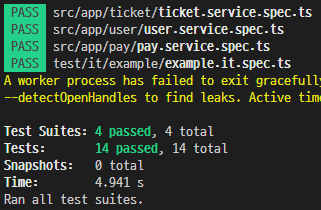

# API Testing Results

## 개요

> 

- 총 테스트 묶음: 4개
- 총 테스트 케이스: 14개
- 성공률: 100%
- 실패 케이스: 없음
- 실행 시간: 4.941초

## 세부사항

### 1. Ticket Service

- 파일: `ticket.service.spec.ts`
- 상태: ✅ 통과
- 요약:
  - 티켓 관리 기능 검증 완료:
    - 상태별 티켓 조회 (`getTicketsByStatus`)
    - 티켓의 좌석 조회 (`getSeatsByTicket`)
    - 예약 가능한 날짜 조회 (`getAvailableDates`)
- 특이사항:
  - 특별한 문제는 없었음.

### 2. User Service

- 파일: `user.service.spec.ts`
- 상태: ✅ 통과
- 요약:
  - 사용자 관련 기능 검증 완료:
    - 사용자 생성 (`createUser`)
    - 포인트 조회 (`getPoint`)
    - 사용자 포인트 및 정보 수정 (`updatePoint`, `updateUser`)
    - 대기열 관리 기능 (`createQueue`, `getQueueStatus`, `clearQueue`)
- 특이사항:
  - 테스트는 통과했으나, 대기열 생성 시 동시성 처리 관련 추가 검토 필요해보임.

### 3. Pay Service

- 파일: `pay.service.spec.ts`
- 상태: ✅ 통과
- 요약:
  - 결제 및 티켓팅 기능 검증 완료:
    - 포인트 충분/부족 상황에서 결제 처리 (`pay`)
    - 좌석 티켓팅 처리 (`ticketing`)
    - 사용자 결제 내역 조회 (`getPayHistoryByUser`)
- 특이사항:
  - 좌석 5분 대기 등 시간 기반 로직에서 발생 가능한 타이머 누락 이슈 확인 필요해보임.

### 4. Example Integration

- 파일: `example.it.spec.ts`
- 상태: ✅ 통과
- 요약: 생략

## 기타사항

### 수행 시간

> 실행 시간 4.941초는 현재 테스트 볼륨에선 적정 수준임.

### Mock 관리

> 테스트 간 Mock 상태 누수 방지를 위해 Mock 데이터를 적절히 초기화해야 함.
