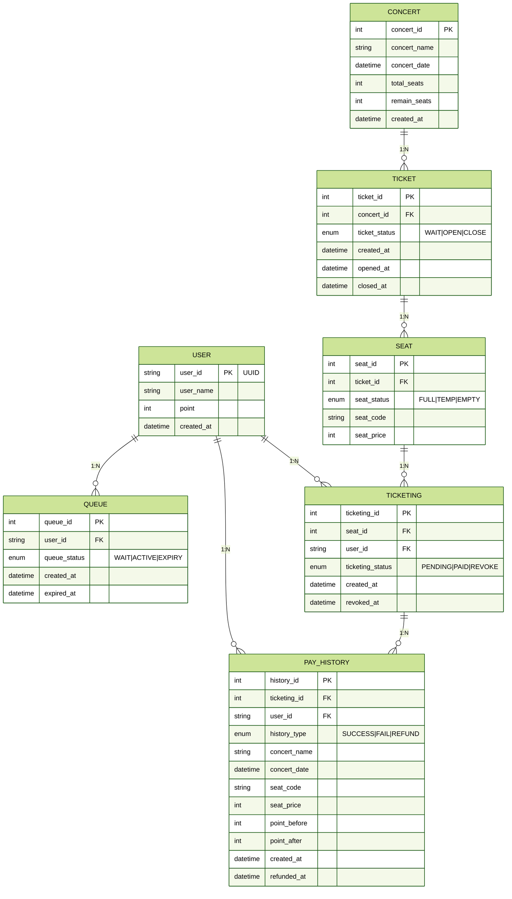

# Entity-Relationship Diagram

```mermaid
---
config:
  theme: forest
---
erDiagram
    USER {
        string user_id PK "UUID"
        string user_name
        int point
        datetime created_at
    }
    QUEUE {
        int queue_id PK
	    string user_id FK
        enum queue_status "WAIT|ACTIVE|EXPIRY"
        datetime created_at
        datetime expired_at
    }


    CONCERT {
        int concert_id PK
        string concert_name
        datetime concert_date
        int total_seats
        int remain_seats
        datetime created_at
    }
    TICKET {
        int ticket_id PK
        int concert_id FK
        enum ticket_status "WAIT|OPEN|CLOSE"
        datetime created_at
        datetime opened_at
        datetime closed_at
    }
    SEAT {
        int seat_id PK
        int ticket_id FK
        enum seat_status "FULL|TEMP|EMPTY"
        string seat_code
        int seat_price
    }
    TICKETING {
        int ticketing_id PK
        int seat_id FK
        string user_id FK
        enum ticketing_status "PENDING|PAID|REVOKE"
        datetime created_at
        datetime revoked_at
    }


    PAY_HISTORY {
        int history_id PK
        int ticketing_id FK
        string user_id FK
        enum history_type "SUCCESS|FAIL|REFUND"

        string concert_name
        datetime concert_date
        string seat_code
        int seat_price

        int point_before
        int point_after

        datetime created_at
        datetime refunded_at
    }


    USER ||--o{ QUEUE : "1:N"
    USER ||--o{ TICKETING : "1:N"
    USER ||--o{ PAY_HISTORY : "1:N"
    TICKETING ||--o{ PAY_HISTORY : "1:N"

    SEAT ||--o{ TICKETING : "1:N"
    TICKET ||--o{ SEAT : "1:N"
    CONCERT ||--o{ TICKET : "1:N"
```
